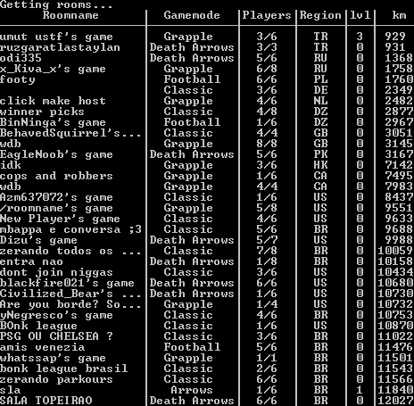

# Bonk room viewer
This is a script that allows you to see all bonk.io rooms without going to bonk.io!

This script requires Python to work

To use this script, open a command prompt on the same folder as main.py and type in: "main.py"

If you are getting "module x not found" error, type in "pip install -r requirements.txt"

